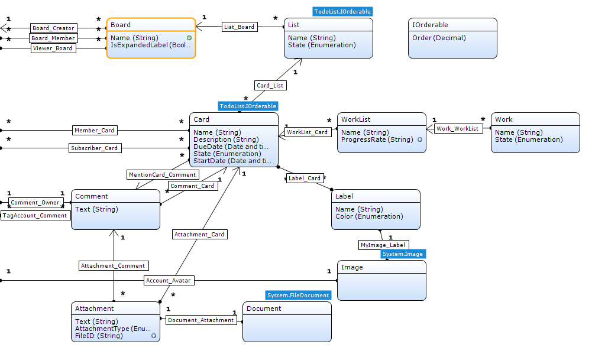

# KanbanPlanningBoard
This code used for "KanbanPlanningBoard Application" by using React combine with Redux.

### Overview

This is the code for [this](https://appstore.home.mendix.com/link/app/78941/SCH/PlanningBoard) application on Mendix Appstore by using React-ReduxJS.

### Description

As one of essential component for all planning apps, the PlanningBoard allows user to manage your project. It could be use for software development, task management, or process management ...

- Support Offline capability
- Easily create List and Card
- Support inline editing for List & Card
- Fully support drag/drop of Card from List->List
- Fully support drag/drop to reoder Card
- Easy to customize

PlanningBoard allows user to manage projects by visualizing tasks as cards in different list.

A card could have description of the task, assignees, start/due date, comments, attachment, subtask list and labels. Lists/sections defines the flow of cards in the project. User drag then drop a card to form one list to other one, or re-order cards in a list.

The PlanningBoard can be seen in many project development tools like Asana, Jira, TFS, and Trello.

### Typical usage scenario
 - Software project development in Scurm/Kanban
 - Business planning

### Features and limitations
 - Easily create List and Card
 - Support inline editing for List & Card
 - Fully support drag/drop of Card from List->List
 - Fully support drag/drop to reoder Card
 - Easy to customize

 

### Dependencies
 - Mendix 7.3.0 and later

### Configuration

The domainmodel will look like this:

After download from Appstore, place the widget into a dataview since it's required to have context for the widget. The widget is designed to support many possiblities of planning but you can start with minimum settings to quickly have working version and adding the rest feature later. All required configs ared mandatory, without them, you will get error in Modeller.

 1. Board (entity,  required): This is the startpoint of everything, this entity should also be the entity of the dataview.
    1.1 Expanded label (attribute, boolean, optional): If true, all the labels will be expanded. (See section 5 for Label)
    1.2 Readonly mode (attribute, boolean, optional): If true, the board is in readonly mode, you cannot create/move List &Card
    1.3 Board-Creator relation (association, optional): Set this link to assocation a board to its creator
    1.4 Board-Member relation (association, optional): Set this link to assocation a board to its members.
    A member then could be assigned a card.

 2. List (entity, required): A board contains multiple List.
    2.1 List name (attribute, string, required): Name of the list, will appeared as title of the list in the board.
    2.2 List order (attribute, decimal, required): Attribute to store the order from Left-> Right of the list.
    2.2 List-Board relation (association, required): The association from list to board. We use this one to retrieve all lists connected to the contextObject (aka, Board in 1) )
    2.3 List Edit Form (form, optional): if you configure this one, it will be call when you edit a list.

 3. Card (entity, required): A List contains multiple Card. Normally, a card has description of what is the task, who is assigned to, who is the creator,  start/duedate, current state (todo/doing), comments, attachments, ... Our widget supports all those possibility.
    3.1 Card Name (attribute, string, required): Name of the card
    3.2 Card Order (attribute, decimal, required): Order of the card on the list.
    3.3 Card-List relation (attribute, association, required): Association from Card -> List. We use this to retrieve cards of a list.
    3.4 Card Description (attribute, string, optional): Description of the card.
    3.5 Card StartDate (attribute, string, optional): Startdate of the card
    3.6 Card DueDate (attribute, string, optional): Duedate of the card. Color of this will turn to red if the current day passes the duate date.
    3.7 Card State (attribute, string, optional): State of a card, it could be Todo, Running, Done.
    3.8 Card Edit Form (attribute, form, optional): If configure this form, when you click on a card, the Form wil be opened.

 4. Comment (entity, optional): comment entity.
    4.1 Comment-Card relation (attribute, association, required): we use this assocation to know if a Card has comments or not.

 5. Label (entity, optional): in planningboard, giving Label to a card is a way to add some additional info to the card.

    For example, I have some labels: Bug, Feature, OnHold, HighPriority, Improve. I can assign more than 1 label to a card and it will look as followed:
    
    

    5.1 Label Name (attribute, string, required): Text will be appeared on the label. In the picture above, it's "Urgent" & "Feature"
    5.2 Label Color (attribute, enum, required): Color of the label.
    5.3 Label-Card relation (attribute, association, required): the association from label to card. We use this one to retrieve all labels connected to card.

 6. Worklist(entity, optional): Sometimes, you can divide a card (task) to sub-tasks. You can config this entity to have this feature.
    6.1 Worklist-Card relation (association, optional): Assocation from Worklist to card.
    6.2 Progress (attribute, string, optional): this properties to specify how many sub-tasks are completed.

 7. Attachment (entity, optional, document-entity inherited): Card can have multiple attachment. If attachment is image, it will be shown on the card.
    7.1 Attachment-Card relation (association): Assocation from Attachment to Card, we use this one to retrieve all attachments of a card.

 8. Member (entity, optional): member entity will be used to config Board's members, Card's members. You can assign members to a card so they will get notified when duedate comes, for example.
    
    

    8.1 Member Name (attribute, string, optional): Name of member to show on Card.
    8.2 Member-Card relation (association, optional): Assocation from Member to Card. We use this one to retrieve assignees. 
    8.3 Member-Avatar relation (assocation, optional): Association from Member to Avatar. We use this one to retrieve member's avatar.

 9. Avatar (entity, optional, System.Image inherited): Entity to store avatar of a member.

  

